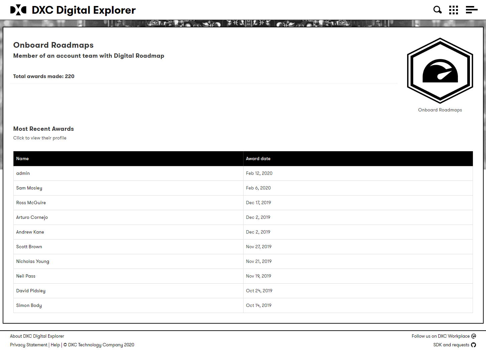
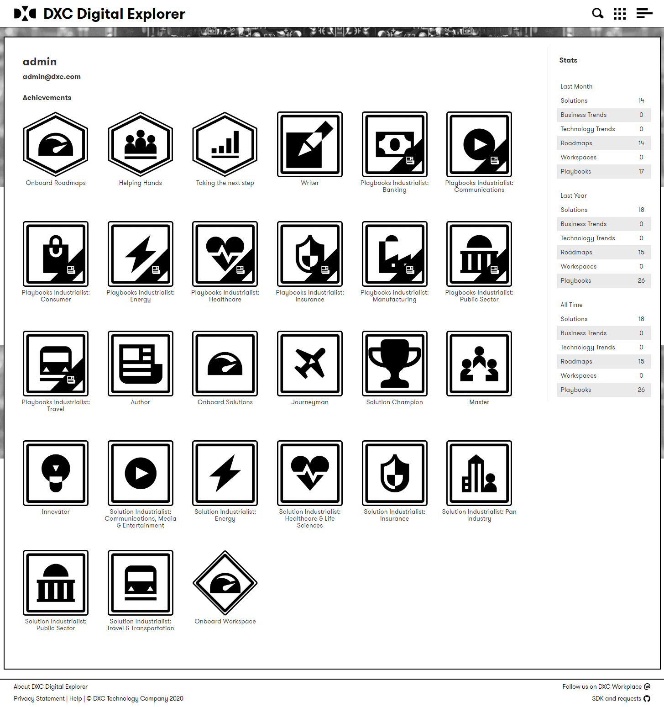
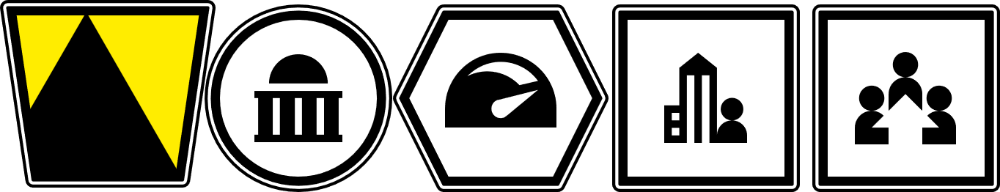

# Digital Explorer Achievement badges.

Digital Explorer awards achievements based on actions completed by users; users are informed of their award and can view their own and drill into details of a single achievement within the user information.

 

The current badges are very poorly design, a result of no dedicated design resource within the product team and a lack of time/investment previous given to this.

**Example achievements**

 

Submitted first solution
Capture a customer idea
Published a Playbook
Published your 5th Playbook

Full list is available [here](https://github.com/dxc-technology/dxc-digitalexplorer/blob/master/Achievements.md)

**Current Design approach followed**

- Each module has it's own style (shape) of badge
- Standard DXC iconset leveraged (industry, actions)
- Common action/achievement theme across all modules

## The ask

Provide a fresh design for the achievements awarded to users of the platform.   The badges will remain to be captured within the Digital Explorer platform, but also published onto Workplace to callout/champion those progressing with the usage/adoption of the platform.

### Constraints
Must align to DXC branding - *feel free to push the boundary*
Icon should be clear at a resolution of 250 x 250

