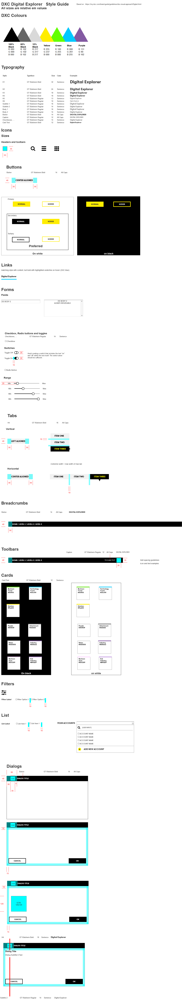

# Digital Explorer Design Guidelines

|Style|Font|Size|Case
|---|---|---|---|
H1|GT Walsheim Bold|32px/2em|Sentence
H2|GT Walsheim Bold|24px/1.5em|Sentence
H3|GT Walsheim Bold|18px/1.125em|Sentence
H4|GT Walsheim Bold|16px/1em|Sentence
H5|GT Walsheim Regular|14.4px/0.90em|Sentence
H6|GT Walsheim Regular|13,6/0.85em|Sentence
SubTitle 1|GT Walsheim Regular|16|Sentence
SubTitle 2|GT Walsheim Regular|14|Sentence
Body 1|GT Walsheim Regular|16px/1em|Sentence
Body 2|GT Walsheim Regular|14|Sentence
Button|GT Walsheim Bold|14|All Caps
Caption|GT Walsheim Regular|12|All Caps
Caption 2|GT Walsheim Regular|12|Sentence
Checkboxes, …|GT Walsheim Regular|14|Sentence
Dialog 1|GT Walsheim Regular|14|Sentence
Dialog 2|GT Walsheim Bold|14|Sentence
Card Text|GT Walsheim Bold|12|Sentence

 
