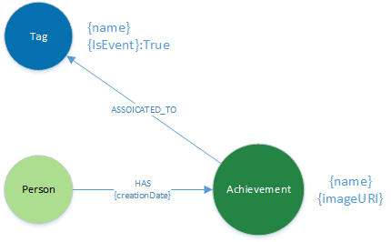
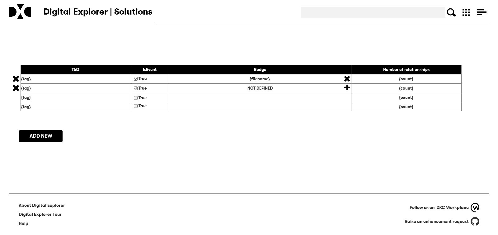
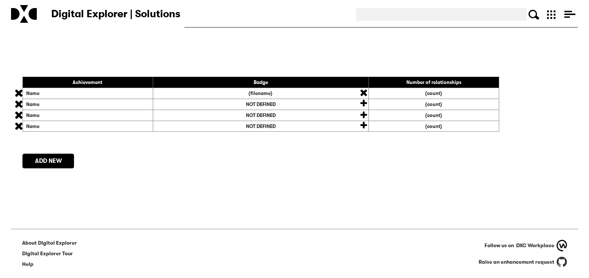

# Data Model

# Admin Pages

restricted to "platform admins"

## Tag Management
Paired page with backend code, allows platform admin to "promote" tags to be tracked as part of a solution tag.   also allows these tags to be assigned the required achievement image.

- Add Badge will allow the user to upload the badge image
- remove badge will delete the attachment
- To edit remove and add

- "Add new" will add a new tag and achievement (if IsEvent is true) nodes into the system

## Achievements

Paired page with backend code, aim is to allow admins to upload/change the badge image for system level achievements
delete should be protected and a clear warning given.

# Events

|Module|Event|Check|Award
|----|----|----|----|
|Solutions|Save solution|Person solution count|Solution badges (1,5,10)
|Solutions|Save Solution|Feature type check|Keep it in the family   We are all friends here   It’s not what I do, it’s how I do it
|Solutions|Save Solution|Trend check|Innovator
|Solutions|Save Solution|Industry check|Industrialist
|Solutions|Save Solution|Check if challenge tag|Event badges (specials)
|Trends|Trend approved|trend count|Trend Badge (1,10)
|Trends|Trend approved|industry check|Industrialist
|Agendas|Save Agenda|Person 2 agenda count|Agenda badge
|Agendas|Save Template|as template is saved|Helping hands|
|Agendas|Create strategic initative|as program is saved|Taking the next step
|Workspaces|Create Workspace|as workspace is created|workspace badge
|Workspaces|Add person to a workspace|as person is added|workspace member badge