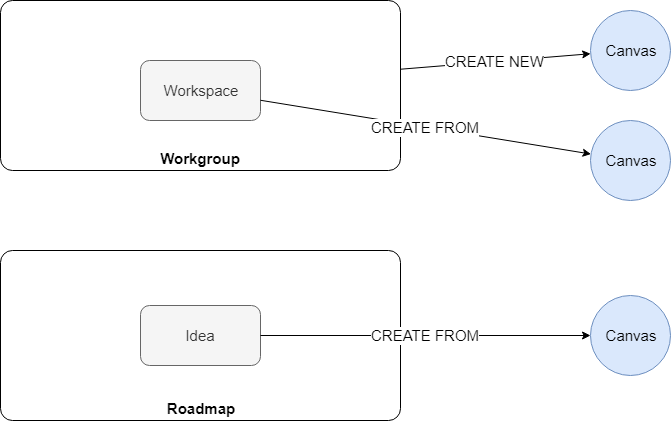

# Canvas

- Relates to enhancement request: [#427](https://github.dxc.com/DigitalExplorer/Digital-Explorer-Specs/issues/427)

**N.B. The pains and gains below are not attempting to outline the pains and gains of the VPC/BMC methods, the focus here is on why we potentially need a canvas model within Digital Explorer**

## Customer Jobs
1. Need to develop/discuss a value proposition canvas related to client needs
2. Need to develop/discuss a business model canvas related to client needs
3. Need to define the early stages of a solution/product with input from a canvas

## Gains
- ability to build a connected viewpoint (1)(2)(3)
- present and discuss information in a clear manner with a customer (1)(2)

## Pains
- current methods are manual/disconnected

## Pain Relievers
- Ability to select researched information into a new canvas

## Gain Creators

- Ability to create a canvas from existing Digital Explorer assets
- Ability to create a solution model from a canvas

## Product

- Canvas add-on within Digital Explorer

----

- Canvas will be created from within the Workgroup
- No dedicated homepage 

----

- [Mock-ups](canvasMocks.md)
- [Data Model](Canvasdatamodel.md)

