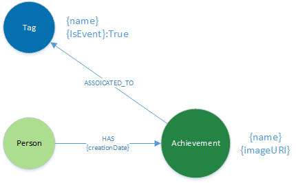

# Achievements
Award achievements to users for submitting solutions and trends into the platform

## Model

- [Awards Overview](awards.md)
- [User Profile](Profile.md)
- [Achievement Page](Achievement.md)

## Approach 
- Track and recognize contribution within the platform via achievements and badges.
- Allow "tags" to be used within Solutions as a means to create "events/Challenges"
- New platform event upon saving content

### Q: How will existing content be reviewed?

The majority of content was bulk loaded via PPT2CSV, thus only new content with a submission date after Nov 2017 will be included within the initial data scan to award achievements.

---
## Approach

1. Prep
    - preload Badge Nodes
    - create the support image files

1. Solution Save Event

1. Revise User Profiles

1. Trend Approval Event

1. Agenda
    - Save Event 
    - Template Save Event
    - Create Initiative Event

1. Workspace 
     - Create event
     - Membership event

1. New Tag management Module
     - New Tag management endpoint (add, edit delete)
     - New tag GET endpoint (name, IsEvent, BadgeURI)
     - New GET tag count endpoint (tagid, relationship count)
     - New tag management UI
     - Update Solution save to support events
