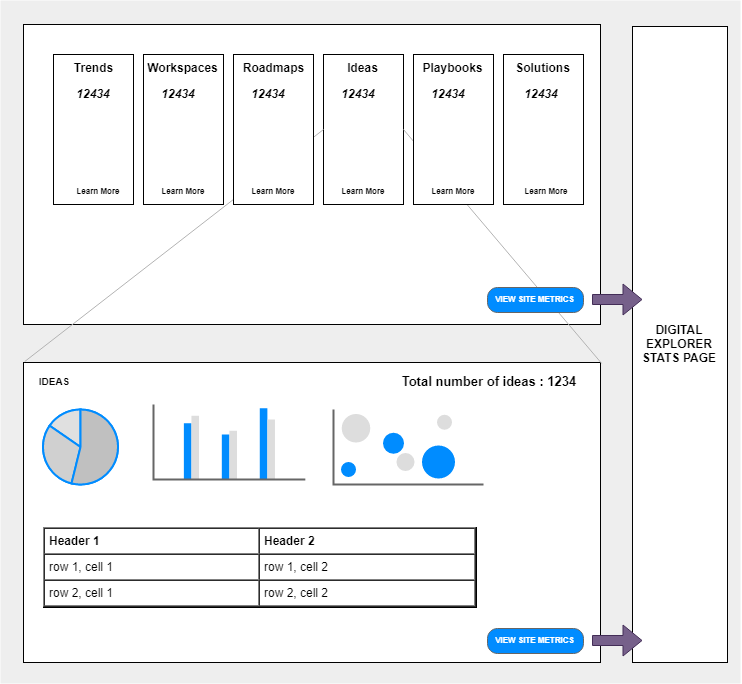
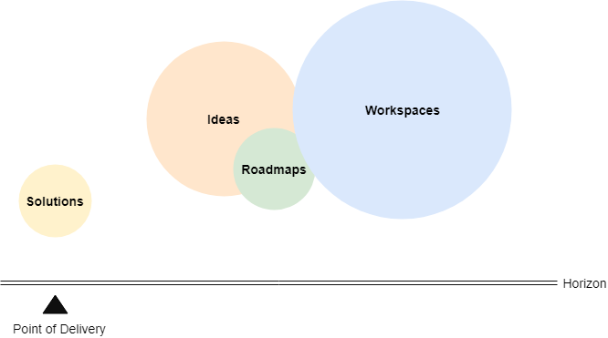
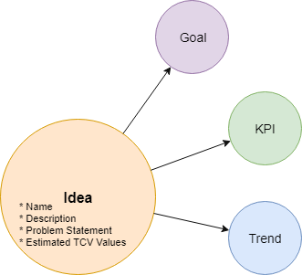

# Digital Explorer PowerBI Dashboard

 

## Top level view
*each would drill into the details below*

- #of Workgroups
- #of Roadmaps
- #of Ideas
- #of Solutions
- #of Playbooks
- Business Trend insights
- Orphans

--- 

 

## Insights into Market demands

### Workspace Insights

Workspaces represent an generic set of market information, from the analyse of an RFPs through to customer investor material.  Workspaces represent potentially the furthest point on the horizon away from a delivery project.

- #of workgroups
- #of workspaces
- Industry breakdown (group level)
- Most reference trends (occurrence counts) (global, account, industry)
- Roadmaps generated
- Playbooks generated
- Ideas captured
- Solutions generated

### Roadmap Insights

Roadmaps capture a proposed journey to reach a customer goal; they are split into business areas and each follow a set timeframe; Often defined as  **Near term**, **mid term** and **long term** periods.

- #of Roadmaps
- Filter by Industry or Region 
- Most reference trends (occurrence counts) (global, region, industry)
- Ideas (global, region, industry)
- Aggregated timeline view (filter by industry)
- Signals
- Cluster of similar trends (3+ occurrence pattern?)

[Existing Digital Explorer Roadmap Insights Dashboard](https://digitalexplorer.dxc.com/bvr/insights)

### Ideas Insights

Ideas or hypothesis' represent a set of proposal's to either be discussed with the customer or considered for internal review to support investment.  Ideas can be captured within either a **Roadmap** or within a **Workgroup**.  Ideas follow a common information model.

 

- #of Ideas
- By region chart
- By industry chart
- Filter by Industry or Region 
- Most reference trends (occurrence counts) (global, region, industry)
- Filter by status 
- Order by votes
- order by estimated revenue values
- Similar Ideas (potential link out to DE idea analyser)

[Existing Digital Explorer Roadmap Insights Dashboard ~ see the Ideas tab](https://digitalexplorer.dxc.com/bvr/insights)

--- 

## Insights into in development and delivered solutions

### Solution Insights
- #of Solutions
- Filter by Industry, Region , Account, Delivery Center
- Filter by type and subType
- Filter by status 
- Top rated solutions
- Trends heatmap
- By Industry chart
- By type chart

 [Existing Digital Explorer Solutions Dashboard](https://digitalexplorer.dxc.com/se/industry-dashboard)

--- 

## Insights into published content

### Playbook Insights
- #of Playbooks
- Filter by Industry
- By Page type chart
- Most referenced trends
- Most referenced solutions
- Top authors (creators)
- Most viewed (need to look at Google Analytics integration)

## Business Trend insights
*Overall summary of business trends across all modules*

- most connected trends

## Orphans
*Summary of trends with no or low number of relationships to main objects*

---

Integration with PowerBI is enabled through the [DE API set-up](https://github.dxc.com/DigitalExplorer/Digital-Explorer-Specs/blob/master/internalContent/DEAPI's/readme.md). 