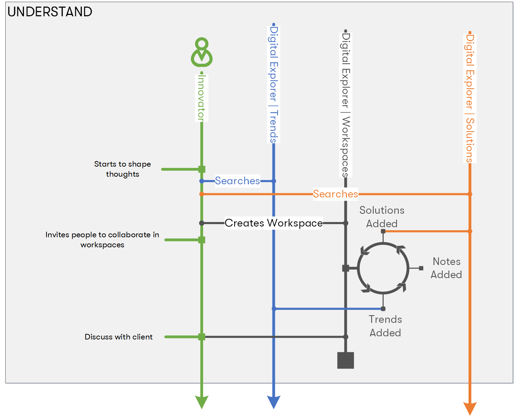

## The Innovator - Understanding

## Target
Uses the platform to understand their clients requirements

**typical profile/role**
* Account CT
* Solution Lead
* Industry Leader

### Activities

* Understand
    * Researches client's industry within Digital Explorer | Trends
    * (optional) - creates new team DE workspace
        * add first trend
        * invites team/colleagues to DE workspace
        * iterate on adding trends, solutions, notes, attachments, views, thoughts

### Missing pieces
* Power of the connected graph - discover more than just the library of solutions, discover other similar agendas, workspaces, discussions.
* Machine Learning to find matches