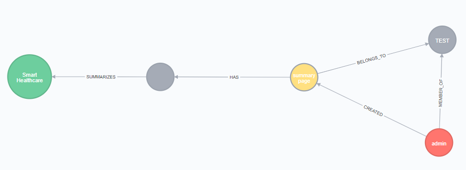

# BVF Book for UKIIMEA Region

Aim : Create a full Playbook with all UKIIMEA Innovation Agenda Summary tables

## Data model

 

~~~
(Person)-[:CREATED]->(Playbook)
(Playbook)-[:BELONGS_TO]->(PlaybookShelf)
(Playbook)-[:HAS {order:x}]->(PlaybookSection)
(PlaybookSection)-[:SUMMARIZES]->(InnovationAgenda)
~~~

## Data values

Person = davidstevens@dxc.com
PlaybookShelf = UKIIMEA Clients

Playbook.dxcOnly=True
Playbook.isPrivate=false
Playbook.bannerTextColour=WHITE
Playbook.creationDate=
Playbook.title=UKIIMEA BVF
Playbook.subtitle=complete BVF viewpoint of all UKIIMEA Innovation Agendas
Playbook.bannerImageURI=
Playbook.coverImageURI=

order = IA creation date

PlaybookSection.layout=SUMMARY
PlaybookSection.text = Account Name & Innovation Agenda Name
PlaybookSection.secondText= Creation Date : <Innovation Agenda Creation date>
PlaybookSection.imageURI = null
PlaybookSection.title = null

---

## Approach

### Extract all UKIIMEA Innovation Agendas

CSV file requires

- Innovation agenda node id
- Region
- Account Name
- Innovation Agenda Name
- Creation Date
- Valid until Date

~~~
match (r:Region)--(a:Account)--(ia:InnovationAgenda),
(a)--(si:SubIndustry)--(i:Industry)
where r.name = 'UK, Ireland, Israel, Middle East and Africa'
return id(ia) as iaID ,r.name as Region,a.name as AccountName ,ia.name as IAName, ia.creationDate as CreationDate, ia.validUntil as ValidUntil,i.name as Industry, si.name as Subindustry
~~~

RETURN apoc.temporal.format(datetime({epochMillis: timestamp()}), "YYYY-MM-dd HH:mm:ss"); 

~~~
convert milliseconds to date in Excel

`=({source cell} / 86400000)+ DATE(1970,1,1)`
set cell to Date format
~~~

**Transfer file to `import` directory on Neo4j server**

### Create playbook script

#### Assumptions
- Playbook Shelf exists
- Person (author) exists

#### Script section 1

Create empty playbook

~~~
CREATE (pb:Playbook {
bannerImageURI :'TBD' ,
bannerTextColour : 'WHITE',
coverImageURI :'TBD' ,
creationDate : 1582270523000,
dxcOnly:true,
isPrivate:false,
title: 'UKIIMEA Test' ,
subtitle : 'UKIIMEA Test'
})
WITH pb
MATCH (pbs:PlaybookShelf {name:'UKIIMEA : Innovation Agenda Summaries'})
MERGE (pb)-[:BELONGS_TO]->(pbs)
WITH pb,pbs
MATCH (p:Person {email:'davidstevens@dxc.com'})
MERGE (p)-[:CREATED]->(pb)
RETURN pb,pbs,p
~~~

#### Script section 2

Create Summary pages

1. Get the playbook
2. add a summary page for each IA
3. 

### Version 2
**One Playbook per industry**

~~~
//GET THE PLAYBOOK
MATCH (pb:Playbook {title:'UKIIMEA Test'})
WITH pb
//CREATE THE SUMMARY PAGE
LOAD csv WITH HEADERS FROM "file:///UKIIMEA.csv" as UKIIMEA
WITH UKIIMEA,pb
WHERE UKIIMEA.Industry='Travel & Transportation'
CREATE (pbs:PlaybookSection {
layout:'SUMMARY',
text: UKIIMEA.AccountName + ': ' + UKIIMEA.IAName,
secondText: 'Creation Date : ' + UKIIMEA.CreationDate2,
imageURI:' ' ,
title: UKIIMEA.AccountName + ': ' + UKIIMEA.IAName
})

//RELATE TO THE PLAYBOOK
WITH pbs,pb,UKIIMEA
MERGE (pb)-[:HAS {order:toInt(UKIIMEA.Order)}]->(pbs)

// RELATE TO THE INNOVATION AGENDA
WITH pbs,pb,UKIIMEA
MATCH (ia) WHERE ID(ia) = toInt(UKIIMEA.iaID)
MERGE (pbs)-[:SUMMARIZES]->(ia)
return pb,pbs,ia
~~~

- [x] Banking & Capital Markets
- [x] Communications, Media & Entertainment
- [x] Consumer Industries & Retail
- [x] Energy
- [x] Healthcare & Life Sciences
- [x] Insurance
- [x] Manufacturing
- [x] Public Sector
- [x] Travel & Transportation

Playbook title :  <Industry Name>
Playbook subTitle : UKIIMEA : Innovation Agenda Summaries

add Costas as Innovation Director