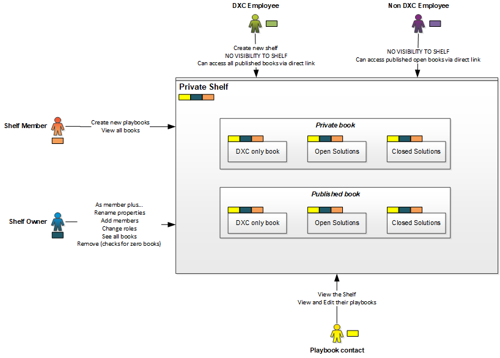
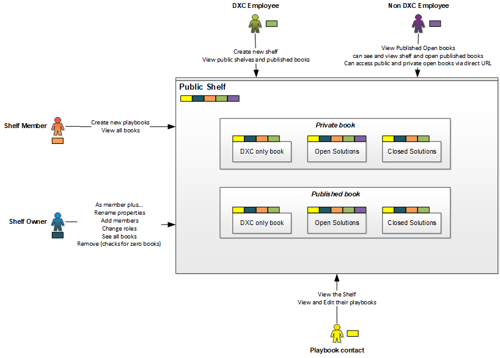

# Playbook Shelves

Playbook shelves allow users to create a group or collection of playbooks.

A user can be assigned as an **Owner** or a **Member** of a playbook shelf

- **Owners** - Can change properties of the shelf (name & Image) and delete the shelf, view and create new playbooks within the shelf
- **Members** - Can view and create new playbooks within the shelf

## Type of Shelf

- **Private** - Restricted to only **owners** and **members** of the shelf group
- **Public** - Shown and accessible to all users

## Types of books

- Open solution Playbook - a Playbook which includes referenceable solutions 
- Closed solution Playbook - a Playbook which includes non-referenceable solutions 
- DXC only Playbook - Global setting to restrict access to a playbook to only DXC employees - irrespective of the solution selection.

## Published versus Private Playbooks

A playbook can be marked as **Published** or **Private**

- **Private** - shown and accessible only to contacts within the Playbook
- **Published** - Accessible to all users, limitations apply based on the type of book and it's content (see above)

---

## Access Look-up Table

### Private Shelf

| | Shelf Owner|Shelf Member|Playbook Contact|DXC employee|Non-dxc user
|---|---|---|---|---|---|---|---|
|Private Open book|X|X|X|Error shown|Error shown
|Private Closed book|X|X|X|Error shown|Error shown
|Private DXC only book|X|X|X|Error shown|Error shown
|Published Open book|X|X|X|Error shown|Error shown
|Published Closed book|X|X|X|Error shown|Error shown
|Published DXC only book|X|X|X|Error shown|Error shown

### Public Shelf

| | Shelf Owner|Shelf Member|Playbook Contact|DXC employee|Non-dxc user
|---|---|---|---|---|---|---|---|
|Private Open book|X|X|X|X*|X*
|Private Closed book|X|X|X|X*|Error shown
|Private DXC only book|X|X|X|X*|Error shown
|Published Open book|X|X|X|X|X
|Published Closed book|X|X|X|X|Error shown
|Published DXC only book|X|X|X|X|Error shown

`* Accessible via Direct URL

