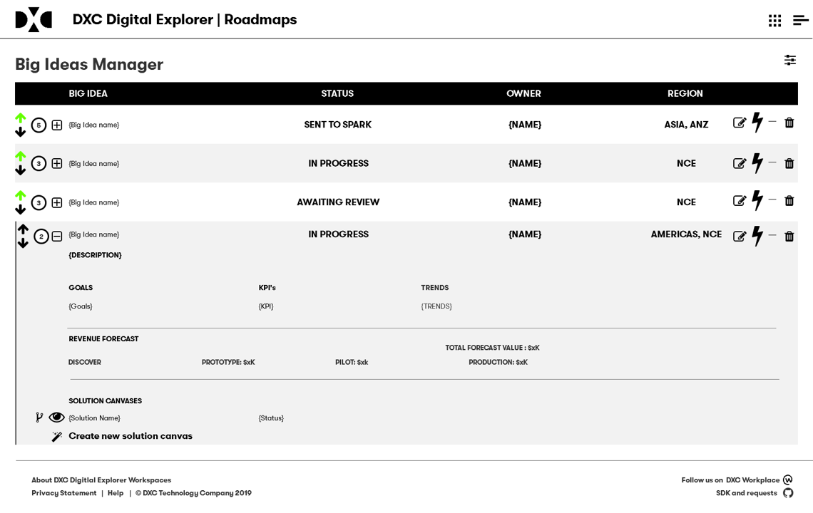

## Big Idea Manager

Single viewpoint for rCTO's and Innovation leads to review current Big Ideas. 

- All users can vote (up and down)
- Expanded view shows all details related to Big Idea
- Option to Send to Spark
- If Big Idea is already sent to Spark, link will open Spark Challenge
- Option to create solution model/canvas within Digital Explorer (same process as with account ideas)

### Big Idea status

- NEW
- APPROVED
- REJECTED
- SENT TO SPARK
- IN PROGRESS
- CLOSED

 
