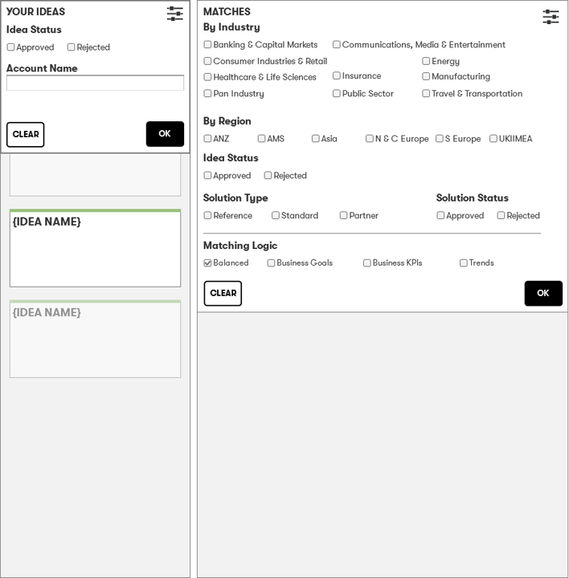

# Idea Dating
## Score logic

###  Balanced (default)
business goals, KPI's and trends have an factor within the results (x1)

### Business Goals
Business goals have an increased factor of (x2) within the results, KPIs and Trends remain at (x1)

### KPIs
KPIs have an increased factor of (x2) within the results, Business goals and Trends remain at (x1)

### Trends
Trends have an increased factor of (x2) within the results, Business goals and Trends remain at (x1)
  
This is managed within the matching filters drop-down

