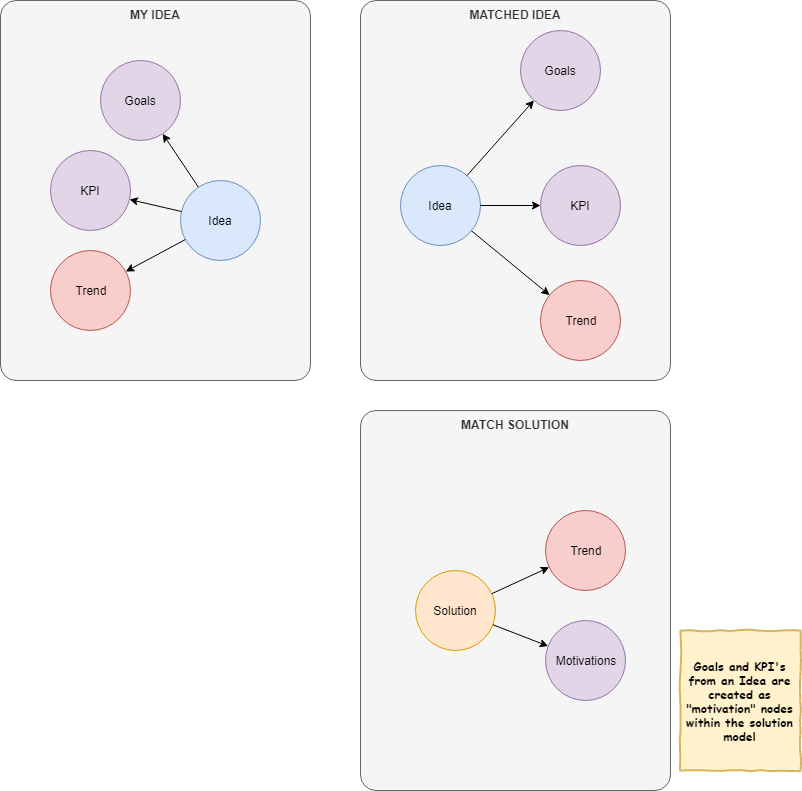

# Idea Dating
## Cloning an existing solution

When a user selects an existing solution to be copied a relationship should be created between both the `idea` and the source `solution` 

 

### Retained source solution information

- Description (c)
- Value Proposition (c)
- Business Value (c)
- Technical Value (c)
- Motivations (c)
- Trends (r)
- Features (r)

(c) - Copied
(r) - Relationship to existing node

### Information dropped from the source solution

- Contacts
- Industry
- Account
- Region
- Referenceable
- SFDC id
- Attachments

### Information inherited from the idea

- Goals
- KPI's
- Trends
- Contacts
- Account
- Industry
- Region
- SFDC id
