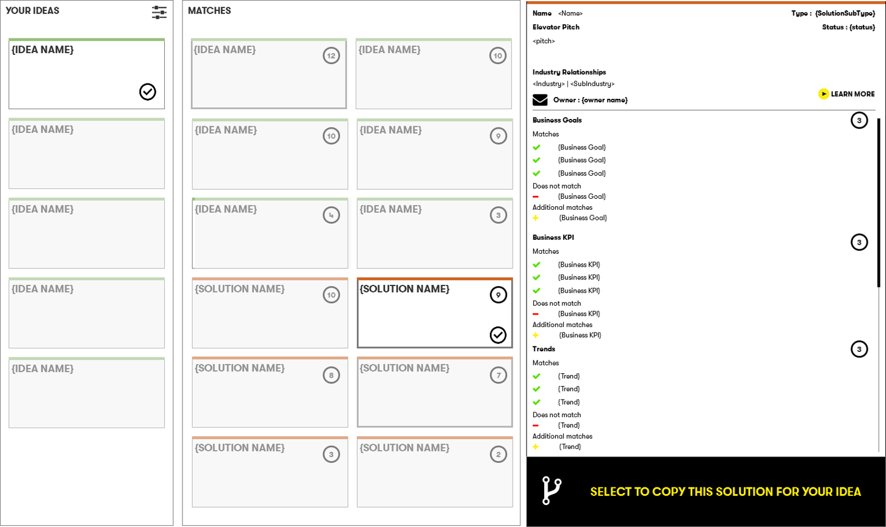
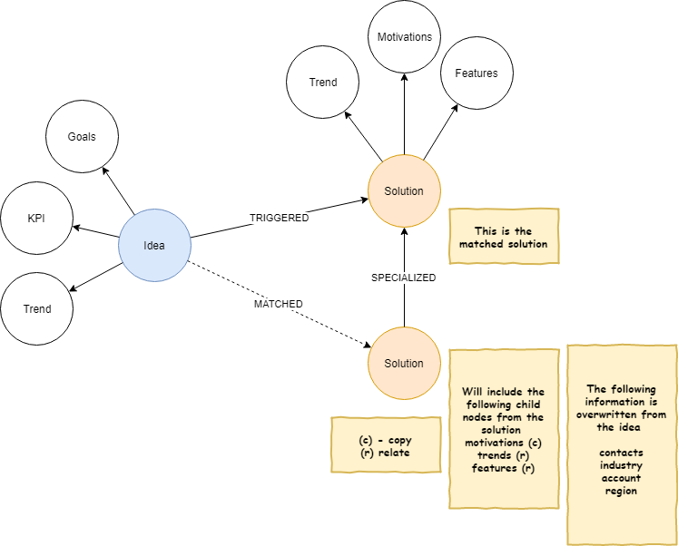

## Idea Matching

Viewing a single solution will return the basic information of the solution, with a `learn more` link to the full datasheet (opens in a new tab). 
The user has the option to copy the matching solution.  See the [datamodel](../datamodel.md) document for details on the created relationships and nodes. 

 
 

[Next](5.md)