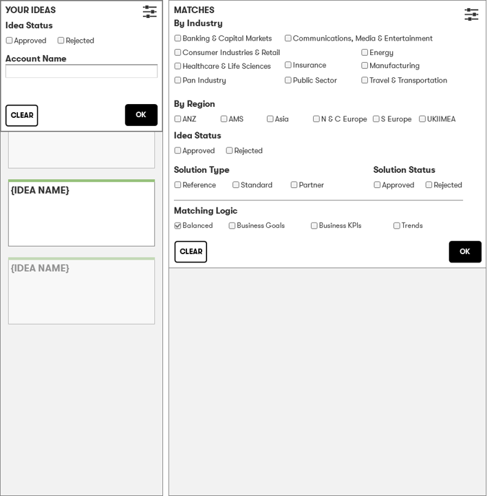

# Idea dating - Filters

 
 

## The users ideas can be filtered based on:

- Status
- Account

The account selection should be provided by a smart-up/search

---

## The matched ideas and solutions can be filtered based on:

- Industry
- Region
- idea status
- Solution Status
- Solution type

### Matching logic

The matching logic can be set between `balanced`, `goals`, `kpi` or `trends`.   See the [Scoring](../Scoring.md) document for details.

---

- [Home](../readme.md)