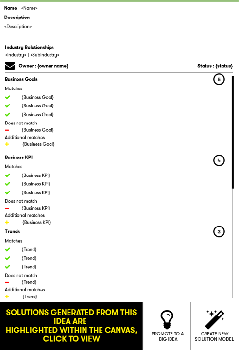

# Idea dating - Big Ideas
The feature of big ideas is restricted to members of the "roadmap manager" role within the platform 
The features allows users to promote a single or group of ideas into a new data type called `BigIdea`
**Big ideas** have their own workflow and tracking pages

 
 

 
 
