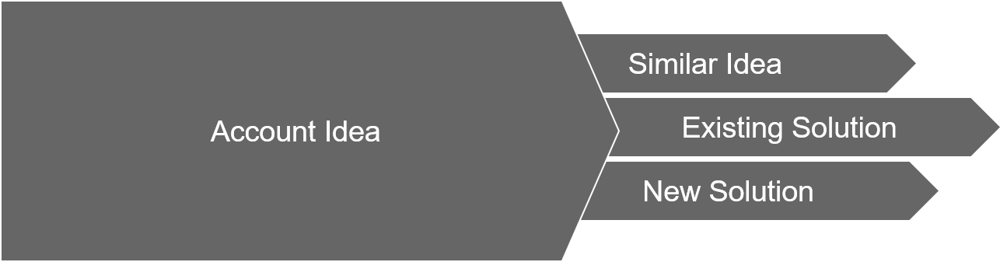
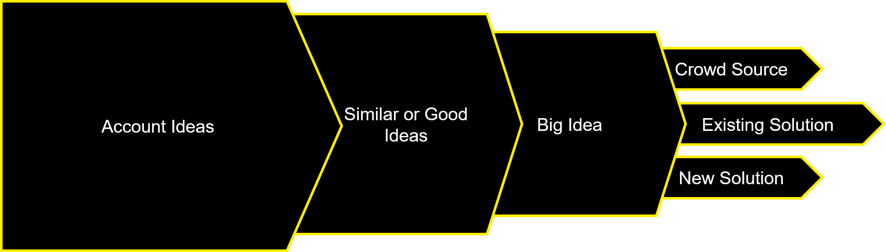

# Idea Dating

Allow account team members to find other matching ideas and potential solutions from the ideas defined within their roadmaps. 

### Benefits

- identify existing solutions for reuse
- identify common ideas for joint development/investment
- reduce duplication

 
_the account flow_  
 
_the regional CTO flow_

 

- [Mock-up Walkthrough](mocks/1.md)
- [Data model](datamodel.md)
- [Scoring Logic](Scoring.md)
- [Big Ideas](bigIdeas.md)