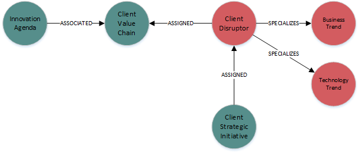

# Roadmap Insights

Requirements

1. Heatmaps of trends and signals based on all roadmaps
    - allow heatmaps to be filtered based on 
        - region
        - industry
        - internal program
        - named user
        - named account
2. Heatmap of trends with a relationship to a strategic initiative
    - allow heatmap to be filtered based on 
        - region
        - industry
        - internal program
        - named user
        - named account
3. Cluster report of trends based on all roadmaps
4. Cluster report of trends with a relationship to a strategic initiative

---
## Data Model viewpoint

---

## Mockups

- [Heatmap of trends](dashboard1.md)
- [Heatmap of signals](dashboard2.md)
- [Heatmap of initiatives](dashboard3.md)

--- 
## d3 examples

heatmaps : http://mbostock.github.io/d3/talk/20111018/treemap.html
cluster report : http://mbostock.github.io/d3/talk/20111116/pack-hierarchy.html