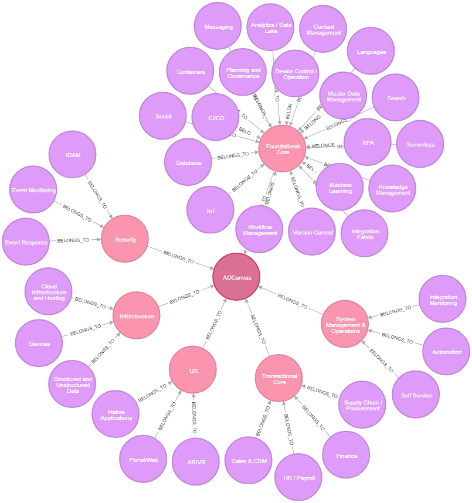

# AO Canvas Tier 2 groups

- Tier 2 groups created for PDXC work - not yet in production.

|Tier 1|Tier 2|
|---|---|
|UX|Portal/Web,Native Applications,AR/VR,Digital Assistants
|Transactional Core|HR / Payroll,Sales & CRM,Supply Chain / Procurement,Finance,Bespoke Business Apps
|Foundational Core|Integration Fabric,IoT,RPA,Serverless,Knowledge Management,Database, Analytics / Data Lake,Version Control,Languages,Messaging,Search,Machine Learning,Containers,Workflow Management,Content Management,Master Data Management,CI/CD,Planning and Governance,Social,Device Control / Operation,Virtualization Layer
|Security|IDAM,Event Monitoring,Event Response,Security Ops
|Infrastructure|Devices,Cloud Infrastructure and Hosting,Structured and Unstructured Data,Network and Telecom
|System Management & Operations|Self Service,Integration Monitoring,Automation,SIAM / ITSM

~~~
///UX
MATCH (tg:TechnologyGroup {name:'UX'})
with tg, SPLIT('Portal/Web,Native Applications,AR/VR,Digital Assistants',",") AS word
UNWIND range (0,size(word)-2) as i 
MERGE (stg:SubTechnologyGroup {name: trim(word[i])}) 
MERGE (stg)-[:BELONGS_TO]->(tg)
return stg,tg
~~~

~~~
///Transactional
MATCH (tg:TechnologyGroup {name:'Transactional Core'})
with tg, SPLIT('HR / Payroll,Sales & CRM,Supply Chain / Procurement,Finance,Bespoke Business Apps',",") AS word
UNWIND range (0,size(word)-2) as i 
MERGE (stg:SubTechnologyGroup {name: trim(word[i])}) 
MERGE (stg)-[:BELONGS_TO]->(tg)
return stg,tg
~~~
~~~
///Foundational
MATCH (tg:TechnologyGroup {name:'Foundational Core'})
with tg, SPLIT('Integration Fabric,IoT,RPA,Serverless,Knowledge Management,Database, Analytics / Data Lake,Version Control,Languages,Messaging,Search,Machine Learning,Containers,Workflow Management,Content Management,Master Data Management,CI/CD,Planning and Governance,Social,Device Control / Operation,Virtualization Layer',",") AS word
UNWIND range (0,size(word)-2) as i 
MERGE (stg:SubTechnologyGroup {name: trim(word[i])}) 
MERGE (stg)-[:BELONGS_TO]->(tg)
return stg,tg
~~~
~~~
///Security
MATCH (tg:TechnologyGroup {name:'Security'})
with tg, SPLIT('IDAM,Event Monitoring,Event Response,Security Ops',",") AS word
UNWIND range (0,size(word)-2) as i 
MERGE (stg:SubTechnologyGroup {name: trim(word[i])}) 
MERGE (stg)-[:BELONGS_TO]->(tg)
return stg,tg
~~~
~~~
///Infrastructure
MATCH (tg:TechnologyGroup {name:'Infrastructure'})
with tg, SPLIT('Devices,Cloud Infrastructure and Hosting,Structured and Unstructured Data,Network and Telecom',",") AS word
UNWIND range (0,size(word)-2) as i 
MERGE (stg:SubTechnologyGroup {name: trim(word[i])}) 
MERGE (stg)-[:BELONGS_TO]->(tg)
return stg,tg
~~~
~~~
///System Management & Operations
MATCH (tg:TechnologyGroup {name:'System Management & Operations'})
with tg, SPLIT('Self Service,Integration Monitoring,Automation,SIAM / ITSM',",") AS word
UNWIND range (0,size(word)-2) as i 
MERGE (stg:SubTechnologyGroup {name: trim(word[i])}) 
MERGE (stg)-[:BELONGS_TO]->(tg)
return stg,tg
~~~
~~~
match (tg:TechnologyGroup)
MERGE (AO:AOCanvas {name:'AOCanvas'})
with tg,AO
MERGE (tg)-[:BELONGS_TO]->(AO)
return tg,AO
~~~
~~~
match (AO:AOCanvas)--(tg:TechnologyGroup)--(stg:SubTechnologyGroup)
return AO,tg,stg
~~~
