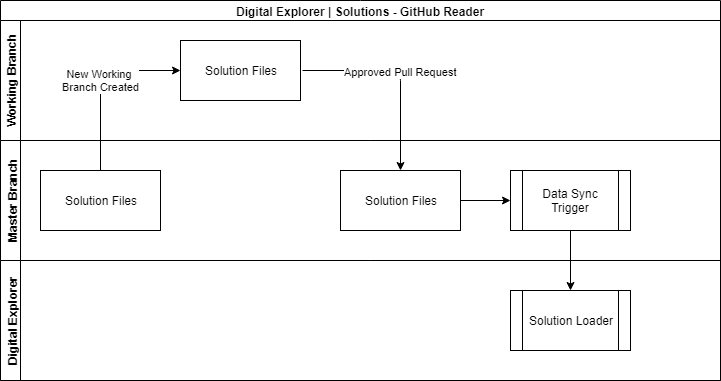

# Digital Explorer | Solutions - GitHub Reader

## Scope
Synchronize solution information from GitHub repositories into the Digital Explorer Solution module.

---
## Requirements
- Solution text to support the same Markdown formatting available within the Digital Explorer module
- All key text fields to be analysed for matching business and technology trends and used to complete the motivations information of the DE solution model
- Solution is set as Read-Only with Digital Explorer
- Digital Explorer ratings and comments are enabled via the solution dataset
- GitHub repositories to be identified based on a common GitHub `topic` : **`Digital Explorer Solution Sync`**
- Synchronization to be automated based on updates to the master branch of the associated repository 
- Master (template) repository to be provided with fork and general usage instructions 
  - Empty template and guidelines
  - Example solution documents
  - Integration with Jenkins instructions (requires request to PDXC Jenkins teams)
  - How to view and validate data sync results

---
## Information Flow

---
## Template Files

The following template files are required

|Template file|DE Solution Model|Mandatory
|---|---|---|
|BaseInformation.md|Solution type, name, status|Yes
|BusinessView.md|value proposition, business value, technical value|Yes
|Motivations.md|motivations, business trends, technology trends|Yes
|Features.md|features|Yes
|Offerings.md|DXC (sub)Offerings|No
|Contacts.md|name, email, role|Yes
|AccountAndIndustry.md|account name, region, sub industry|Yes
|ClientTestimonial.md|SFDC info, client testimonial, FTE, TCV|No
|Media.md|links to external media, description (friendly name)|No

---