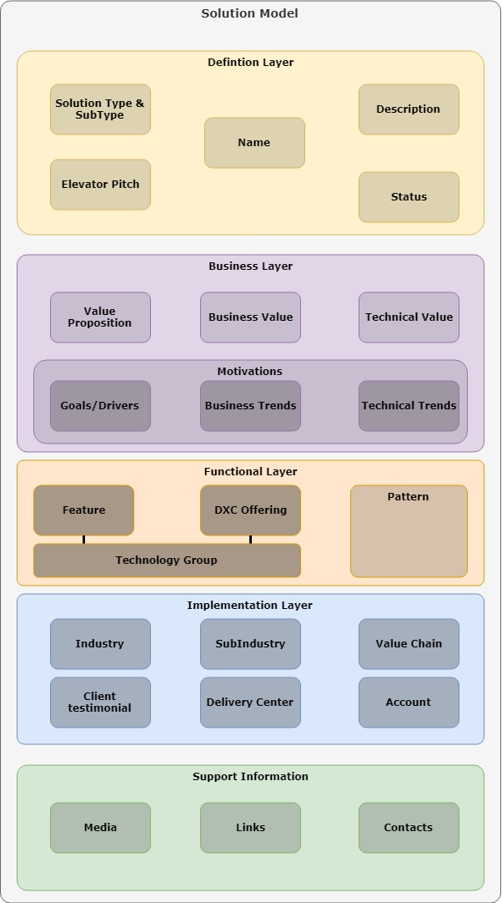

# Digital Explorer GitHub Solution Sync

## Overview
The Digital Explorer Solution Sync GitHub application provides the means for solution owners to document their solutions within DXC GitHub instance and push their solution model into Digital Explorer; thus allow other users the means to 

## Information Model Overview

 

## Template overview

**TO BE COMPLETED**

:warning: The file structure and guidance within each template must be followed; failure to do so will result in a failed load or sync into Digital Explorer.

More details on the integration and best practices, can be viewed [here](https://github.com/dxc-technology/dxc-digitalexplorer/blob/master/Modules/Solutions/GitHubReader/readme.md).