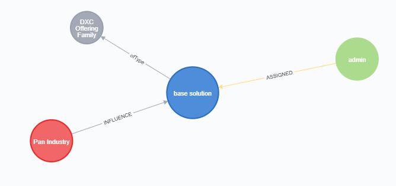

# Manual loading from a simple excel
Creates a base model for a solution

- type
- name
- status
- pitch
- description
- value prop
- business value
- technical value
- contact
- pan industry mapping

 

### Data model

~~~
(Solution)-[:ofType]-(SolutionSubType)
(Person)-[:ASSIGNED {role:''}]->(Solution)
(SubIndustry {name:'Pan Industry'})-[:INFLUENCE]->(Solution)
~~~

### Solution node property values
~~~
  "description": "base solution",
  "isPrivate": true,
  "creationDate": 1588255087202,
  "generalValue": "base solution",
  "elevatorPitch": "base solution",
  "lastModificationDate": 1588255087202,
  "createdBy": "admin@dxc.com",
  "referenceable": "No",
  "businessValue": "base solution",
  "name": "base solution",
  "clientTestimonial": "",
  "status": "Demo"
  ~~~

  ### CSV structure

 `Type,Sub Type,Name,Status,Pitch,Description,Value Prop,BusinessValue,technicalValue,Approach,Owner,ownerEmail`

### Import Script

~~~
LOAD csv with headers from "file:///basedata.csv" as basedata
//REMOVE EMPTY CELLS
//WITH DFPDD WHERE DFPDD.EMPLID IS NOT NULL OR DFPDD.EMAIL_ADDR IS NOT NULL OR DFPDD.NAME IS NOT NULL

MERGE (s:Solution {name:trim(basedata.Name)})
set s.description=basedata.description
set s.isPrivate=false 
set s.creationDate=1588255087202
set s.generalValue=basedata.ValueProp 
set s.elevatorPitch=basedata.Pitch
set s.lastModificationDate=1588255087202
set s.createdBy="davidstevens@dxc.com"
set s.referenceable="No"
set s.businessValue=basedata.BusinessChallenge + ' ' + basedata.WhyDXC
set s.technicalValue=basedata.Approach
set s.status=basedata.Status
set s.clientTestimonial=''

WITH s,basedata
//MATCH (p:Person {name:tolower(trim(basedata.Owner))})
MATCH (p:Person {email:'davidstevens@dxc.com'})
MERGE (p)-[:ASSIGNED {role:'Temporary Contact'}]->(s)
with s,p
MATCH (si:SubIndustry {name:'Pan Industry'})
MERGE (si)-[:INFLUENCE]->(s)

with s,p,si
match (sst:SolutionSubType {name:'DXC Sub Offerings'})
merge (s)-[:ofType]->(sst)
return s,p,si,sst

~~~

### Solution Type

`(Solution)-[:ofType]-(SolutionSubType)`

### Connect to Trends

#### Data Model
~~~
(BusinessTrend)-[:INFLUENCE]->(Solution)
(TechnologyTrend)-[:INFLUENCE]->(Solution)
~~~

### Script

~~~
LOAD csv with headers from "file:///basedata.csv" as basedata
WITH basedata
MATCH (s:Solution {name:trim(basedata.Name)})
WITH s
MATCH (bt:BusinessTrend)
WHERE tolower(s.description) CONTAINS tolower(bt.name)
OR tolower(s.name) CONTAINS tolower(bt.name)
OR tolower(s.generalValue) CONTAINS tolower(bt.name)
OR tolower(s.businessValue) CONTAINS tolower(bt.name)
OR tolower(s.technicalValue) CONTAINS tolower(bt.name)
OR tolower(s.elevatorPitch)  CONTAINS tolower(bt.name)
MERGE (bt)-[:INFLUENCE]->(s)
with s,bt
MATCH (tt:TechnologyTrend)
WHERE tolower(s.description) CONTAINS tolower(tt.name) 
OR tolower(s.name) CONTAINS tolower(tt.name)
OR tolower(s.generalValue) CONTAINS tolower(tt.name)
OR tolower(s.businessValue) CONTAINS tolower(tt.name)
OR tolower(s.technicalValue) CONTAINS tolower(tt.name)
OR tolower(s.elevatorPitch)  CONTAINS tolower(tt.name)
MERGE (tt)-[:INFLUENCE]->(s)
return s,bt,tt
~~~

### Connecting to the SalesGuide Data
**Special action for sub-offerings**

~~~
match (sst:SolutionSubType{name:'DXC Sub Offerings'})--(s:Solution),(wsg:WorkspaceGroup {name:'DXC Offerings'})--(ws:Workspace)--(a:Attachment)-[:REFERENCED]-(t:TechnologyTrend)
where tolower(a.name) contains tolower(s.name)
MERGE (s)<-[:INFLUENCE]-(t)
return a, s,t
~~~
