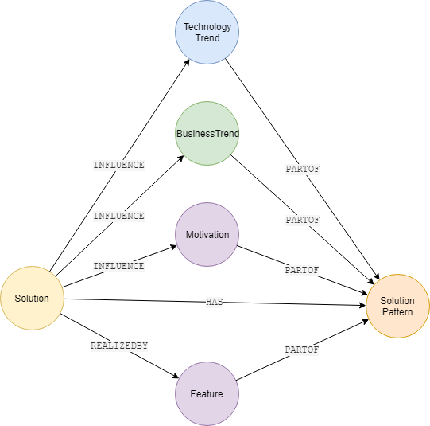

# Solution Patterns

- R1 : Standard Patterns
- R2 : Allow patterns to be selected within a Playbook
- R3 : Update Solution Copy to support Patterns
- R4 : Pattern options can be flagged as mandatory or optional

## Data Model

 

## UI

### Add/Edit

### DataSheet

### Playbooks
Allow authors the means to 

## Solution Copy

