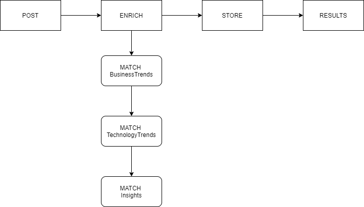
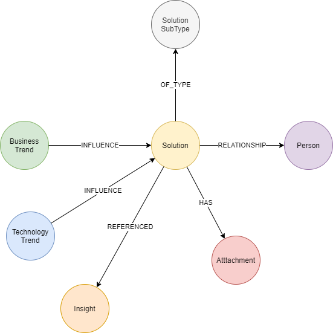

# Digital Explorer - Solutions
## Signpost API

The signpost API creates an enriched representation of any asset within the DXC Digital Explorer Graph database; 

- The signposted entry is added to the solutions dataset and available within the recommendations algorithms (Workspaces and Roadmaps)
- The owners are provided with a summary of the matched reference points from the following DXC datasets
  - Technology Trends
  - Business Trends
  - Text Analytics Insights

## Input Flow

 

## Associated Datamodel

 

### Input properties

|property|description|notes
|---|---|---|
|AssetType|Type of asset being added to the database, must have a corresponding solution subType defined within the Graph
|Asset Name|free text name of the asset
|Elevator Pitch|short text description of the asset|max 240 characters
|Description|free text description of the asset|max 5000 characters, markdown supported
|Status|production or usage status of the asset (e.g.  `In Development`, `In Production`)
|Contacts|list of people associated to the asset|{name, email, role}
|Reference URL|Link to master asset location

### Control values 

|property|description|notes
|---|---|---|
|eUID|Existing UID of asset from external source location|Optional
|referenceable|Can the asset be shared with DXC clients (public classification)|default=no
|searchable|Is the asset included within search and recommendation results|default=true
|isPrivate|Is the asset marked as private and restricted to only named contacts|default=false
|CreationDate|Set upon initial creation
|LastModifiedDate|Updated when matching eUID is provided

### Fixed values

|property|description|set value
|---|---|---|
|solution.objectClass|Archimate object class value|ArchiMate_Product
|solution.source| |SignPostAPI
|attachment.attachmentType| | REMOTE
|attachment.docType| | WWW
|attachment.name| | `Source Location`

## Enrichment

The following text properties are analysed 

- asset name
- elevator pitch
- description

and matched against the following data sets

- BusinessTrends
- TechnologyTrends
- Insights

The matching is run against lowercase matches from both sources

## Store logic

### eUID matching
If a matching eUID is provided, the following properties are updated and the enrichment algorithms are rerun against the updated text properties

- asset name
- elevator Pitch
- description
- status

## Share results

Upon successful completion of the enrichment and storage of the asset within the graph database the following information is returned to the users

- runtime
- Graph Asset ID
- List of matched business trends
- list of matched technology trends
- list of matched insights
- link to asset (solution) datasheet
