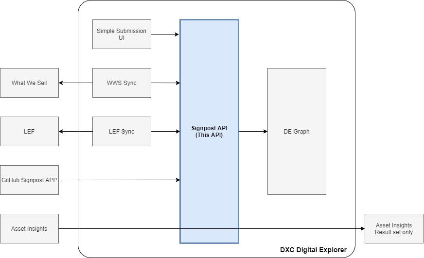
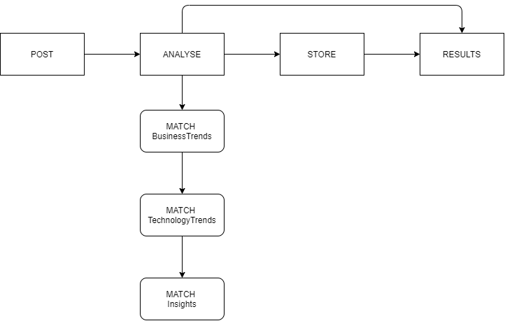

# Digital Explorer - Solutions
## Signpost entry
### API definition 

The signpost API creates an enriched representation of any asset within the DXC Digital Explorer Graph database.

- The signposted entry is added to the solutions dataset and available within the recommendations algorithms (Workspaces and Roadmaps)
- The owners are provided with a summary of the matched reference points from the following DXC datasets
  - Technology Trends
  - Business Trends
  - Text Analytics Insights

## Scenarios

 

### Use Cases

- Analyse and store (default)
  - Content is analysed and stored within the DXC Graph database
- Analyse only
  - Content is passed through the analyse engine only and matched trends and insights are returned to the requestor 

## Input Flow

 

## Associated Datamodel

 

### Input properties

|property|description|notes
|---|---|---|
|AssetType|Type of asset being added to the database | **Must have a corresponding solution subType defined within Digital Explorer**
|Asset Name|free text name of the asset
|Elevator Pitch|short text description of the asset|max 240 characters
|Description|free text description of the asset|max 5000 characters, markdown supported
|Status|production or usage status of the asset |(e.g.  "In Development", "In Production")
|Contacts|list of people associated to the asset|{name, email, role}
|Reference URL|list of URLs | e.g. Link to master asset location
|Tag|list of tags|

### Control values 

|property|description|notes
|---|---|---|
|eUID|Existing UID of asset from external source location|Optional
|Store|Store the simplified solution model and enrichments within the graph|default=yes
|solution.referenceable|Can the asset be shared with DXC clients (public classification)|default=no
|solution.searchable|Is the asset included within search and recommendation results|default=true
|solution.isPrivate|Is the asset marked as private and restricted to only named contacts|default=false
|solution.CreationDate|Set upon initial creation
|solution.LastModifiedDate|Updated when matching eUID is provided

### Fixed values

|property|description|set value
|---|---|---|
|solution.objectClass|Archimate object class value|ArchiMate_Product
|solution.source| |SignPostAPI
|attachment.attachmentType| | REMOTE
|attachment.docType| | WWW
|attachment.name| | Source Location

## Analyse

The following input properties are analysed 

- asset name
- elevator pitch
- description

and matched against the following data sets

- BusinessTrends
- TechnologyTrends
- Insights

### Pre-processing
- text is converted to lower case
- special characters are removed
- html and markdown encoding is removed

### processing
- matched data points are converted to lower case

### post-processing

- none

## Store logic

### eUID matching
If a matching eUID is provided, the following properties are updated and the enrichment algorithms are rerun against the updated text properties

- asset name
- elevator Pitch
- description
- status
- LastModifiedDate

If a new eUID is provided a new entry is created within the graph database.

- CreationDate & LastModifiedDate are set to the date & time the initial entry is created.

## Output results

Upon successful completion of the enrichment and storage of the asset within the graph database the following information is returned to the users

- Runtime
- Graph Asset ID
- List of matched business trends
- list of matched technology trends
- list of matched insights
- link to asset (solution) datasheet

----

## Open points

- DE badge award for initial submission - how?
- Simple UI form to add ??
- Would the existing edit feature work?  or enforce restrictions?
- Show insights in datasheet

----

## Secondary Use Cases

- Employee Fingerprint - The Knowledge Social Graph
