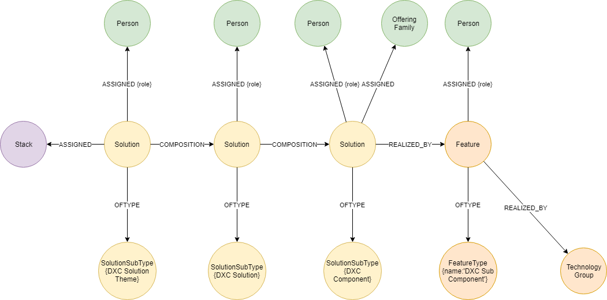

# TRM offering taxonomy sync

- [TRM site](https://dxcportal.sharepoint.com/sites/offeringsTaxonomyCMDB/SitePages/Home.aspx)
- Sections/Files
  - DXCTRM : https://dxcportal.sharepoint.com/sites/offeringsTaxonomyCMDB/SitePages/Stack_Navigator.aspx
  - DXCTRM2 : https://dxcportal.sharepoint.com/sites/offeringsTaxonomyCMDB/SitePages/Taxonomy%20-%20Unique%20IDs.aspx

## Data Model

 

`(DXCStack)<-[:ASSIGNED]-(Solution)-[:COMPOSITION]->(Solution)[:COMPOSITION]->(Solution)-[REALIZED_BY]->(Feature)`

---
### Data export requirements
- CSV\JSON output should not include `spaces` or `: in column/field names 

**NOTE I HAVE DOUBLED LABELED THE `SOLUTION` NODE WITH THE SUBTYPE; THIS ALLOWS FOR EASIER QUERIES AND VISUALS WITHIN NEO4J**

## Base Model

### Stack
`Stack:DXC_ID` - renamed to `Stack_DXC_ID`
`Stack`

~~~
LOAD CSV WITH HEADERS FROM  "file:///DXCTRM.csv" as DXCTRM
MERGE (s:DXCStack {name:DXCTRM.Stack, DXC_ID:DXCTRM.Stack_DXC_ID})
return s
~~~

### Solution Themes
`Solution Theme:DXC_ID` - renamed to `Solution_Theme_DXC_ID`
`Solution Theme` - renamed to `Solution_Theme`

~~~
LOAD CSV WITH HEADERS FROM  "file:///DXCTRM.csv" as DXCTRM
MATCH (sst:SolutionSubType {name:'DXC Solution Theme'})
WITH DXCTRM,sst
MERGE (st:Solution:DXCSolutionTheme {name:DXCTRM.Solution_Theme, DXC_ID:DXCTRM.Solution_Theme_DXC_ID})-[:OFTYPE]->(sst)
WITH st,sst,DXCTRM
//Relate to the Stack
MATCH (s:DXCStack {DXC_ID:DXCTRM.Stack_DXC_ID})
MERGE (st)<-[:ASSIGNED]-(s)
return s,sst,st
~~~

### DXC Solutions
`S3_ID`
`Solution`

~~~
LOAD CSV WITH HEADERS FROM  "file:///DXCTRM.csv" as DXCTRM
MATCH (sst:SolutionSubType {name:'DXC Solution'})--(st:SolutionType {name:'Reference DataSets'})
WITH DXCTRM,sst
MERGE (s:Solution:DXCSolution {name:DXCTRM.Solution, DXC_ID:DXCTRM.S3_ID})-[:OFTYPE]->(sst)
WITH s,sst,DXCTRM
//Relate to the Solution Theme
MATCH (st:Solution {DXC_ID:DXCTRM.Solution_Theme_DXC_ID})
MERGE (s)<-[:COMPOSITION]-(st)
return s,st,sst
~~~

### DXC Components
`DXC Sub Offering` renamed to `DXC_Sub_Offering`
`DXC_ID`
`Status:Title` renamed to `Status_Title`

`S3_ID`

~~~
LOAD CSV WITH HEADERS FROM  "file:///DXCTRM2.csv" as DXCTRM
MATCH (sst:SolutionSubType {name:'DXC Component'})--(st:SolutionType {name:'Reference DataSets'})
WITH DXCTRM,sst
MERGE (sc:Solution:DXCComponent {DXC_ID:DXCTRM.DXC_ID,name:DXCTRM.DXC_Sub_Offering,status:DXCTRM.Status_Title})
//relate to the solution
WITH sc,sst,DXCTRM
MATCH (s:Solution {DXC_ID:DXCTRM.S3_ID})
MERGE (sc)<-[:COMPOSITION]-(s)
return sc,s,sst
~~~

### DXC Sub Components
_NO DATA YET_

## Contacts
_NO DATA YET_

---

## Setup notes
in production these would be managed on the DE Central platform

### Solution subtypes

~~~
MATCH (st:SolutionType {name:'Reference DataSets'})
WITH st
MERGE (st)-[r:SubType]->(sst:SolutionSubType {name:'DXC Solution Theme'})
return st,sst,r
~~~

~~~
MATCH (st:SolutionType {name:'Reference DataSets'})
WITH st
MERGE (st)-[r:SubType]->(sst:SolutionSubType {name:'DXC Solution'})
return st,sst,r
~~~

~~~
MATCH (st:SolutionType {name:'Reference DataSets'})
WITH st
MERGE (st)-[r:SubType]->(sst:SolutionSubType {name:'DXC Component'})
return st,sst,r
~~~

