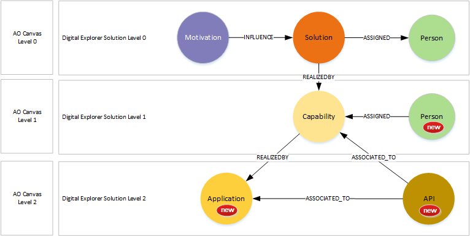
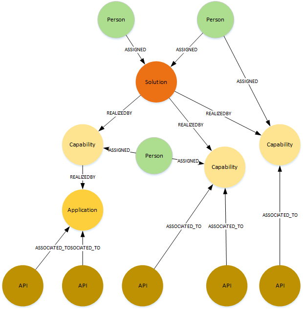
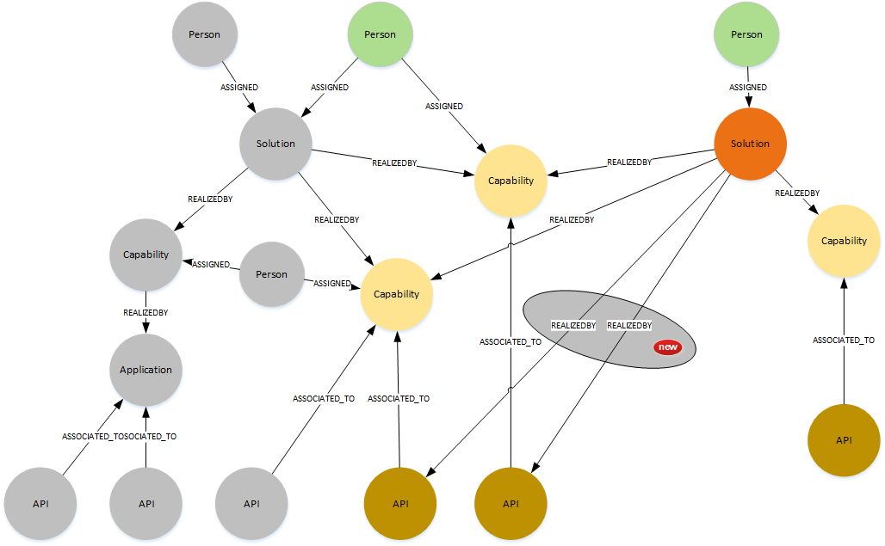
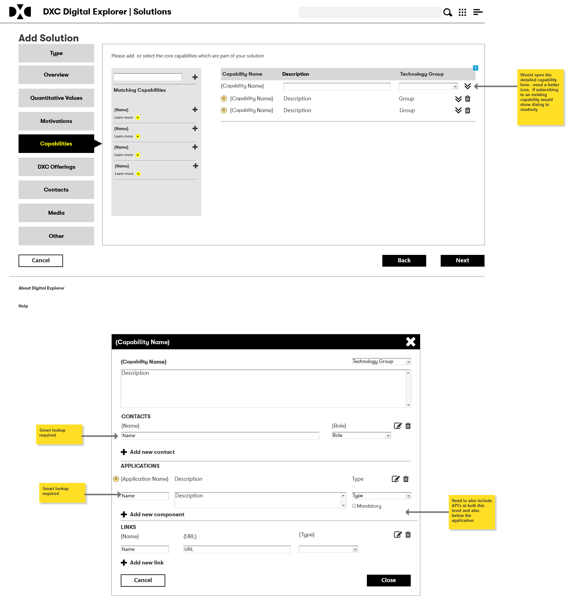
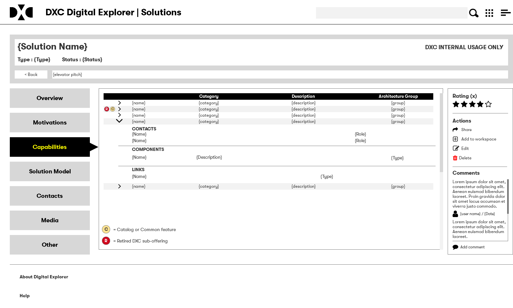
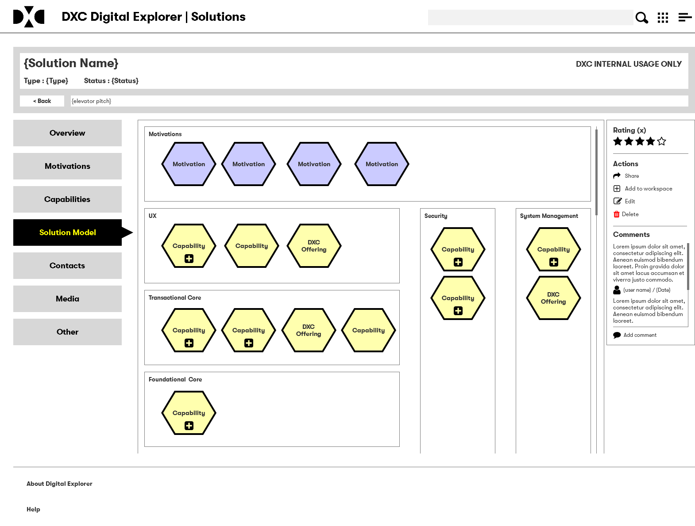

# Digital Explorer Solutions Technical and API viewpoints

### Requirements
- Allow lower level details to be represented within solution models
- ensure alignment with the DXC AO Canvas
- Extend the solutions model to allow technical and API viewpoints to be defined within the solutions model
- Allow new solutions to be assembled from level 1 & 2 building blocks
- Allow each capability to have one or more owners
- Allow each capability to store an external reference URL (e.g. github repo docs)
- Allow each application or API to store an external reference URL (e.g. github repo docs)

### Challenges
- The UI needs to be carefully considered 
- Performance of saving solutions model 

### Revised Solution Model (Draft)
- [Current Solution model](https://github.com/dxc-technology/dxc-digitalexplorer/blob/master/MetaModels/SolutionMetaModel.md) 

### Example single solution viewpoint

### Example shared solution capabilities and API views
#### :confounded:  
needs more work, as there is no clear owner of the capability, every solution has an equal relationship to the capability or API 

## Open points
- APIs 1 per action? (GET, PUT, DELETE) or 1 per API and include a lower level node for actions?
- Need to track owner (solution) of each capabilities and "subscribing" solutions where the capability is referenced/used.
  - Owners needs to be able to edit capability and API details AND understand/inform subscribing solutions
  - Subscribers need a clear view of degraded/changes capabilities and API's
- Potential for devcentral.dxc.com integration?
  - DevCentral (DC) owns the API definitions 
  - DE owns the solution and capability definitions
  - DE pushes new solution and capability definitions to DC
  - DE pulls API definitions from DC
  - DC allows users to add new capability and API for managed solutions
  - DE pulls new capabilities and API's from DC

### AO Canvas

- Level 1 capabilities have a clear placement within the level 1 AO canvas domains
- Level 2 applications and API's have a clear placement within the level 2 AO canvas domains

## UI Work

### add/edit
- Based on the current form based approach within DE

### Data Sheet
#### Features table

#### Solution data model

#### Open points
- Would prefer a full "drawing" UI