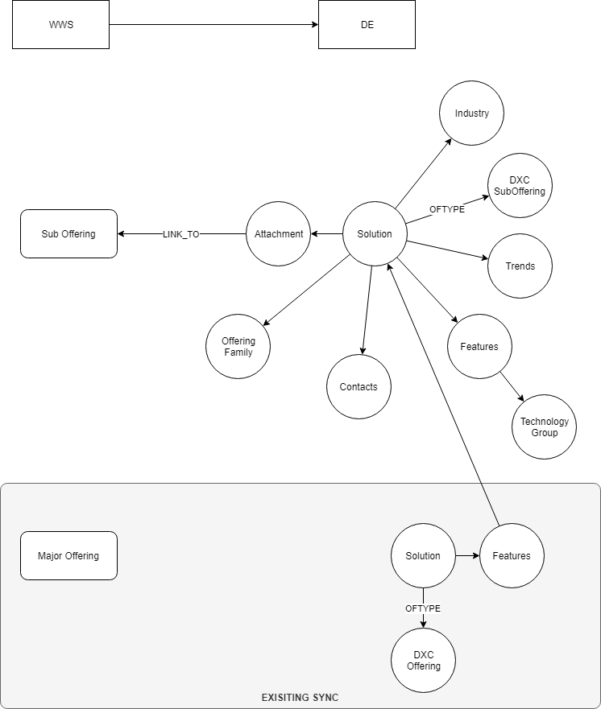

# WWS Sync R2

The aim of the WWS R2 sync is to provide more information for each sub offering into Digital Explorer.

 

---

https://whatwesell.dxc.com/dxc/about-wws/api/

## API call

`https://api.whatwesell.dxc.com/2.0/items/? fq_page_type=Sub-Offering,Major Offering`

`https://api.whatwesell.dxc.com/2.0/items/?fq_page_type=Sub-Offering&fq_offering_family=Analytics`

