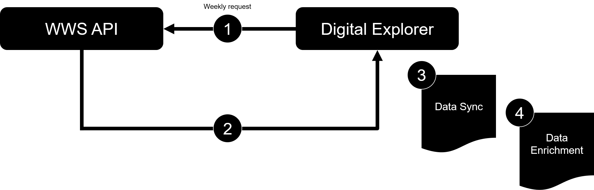

# What We Sell data sync into Digital Explorer

## Aim 
Ensure an the offering family information is aligned with the master dataset on What We Sell and enriched with Digital Explorer trend information in order to support the discovery of offerings during the development of the DXC Digital Blueprint or Innovation Agenda.

|step | Description|
|----|----|
|1| weekly call to the WWS API ~ Monday @6am GMT|
|2| return requested data|
|3| Data sync - add/amend/delete operations
|4| Data enrichment - match Major and Minor descriptions against Digital Explorer Business and Technology trends `(Solution)<-[:INFLUCENCES]-(Trend)`

---

### High level data mapping

|Data element|WWS | Digital Explorer|
|----|----|----|
|Offering Family| L3 | OfferingFamily
|Major Offering | L4 | (Solution)-[:OFTYPE]->(SolutionType {name:'DXC Offering'})
|Sub Offering | L5 | (Feature)-[:OFTYPE]->(FeatureCategory {name:'DXC Offering'})

---

- [Data Sync](dataSync.md)
- [sample calls and data](calls&Data.md)
- [Retrieve data from DE post load](DEWWSQuery.md)