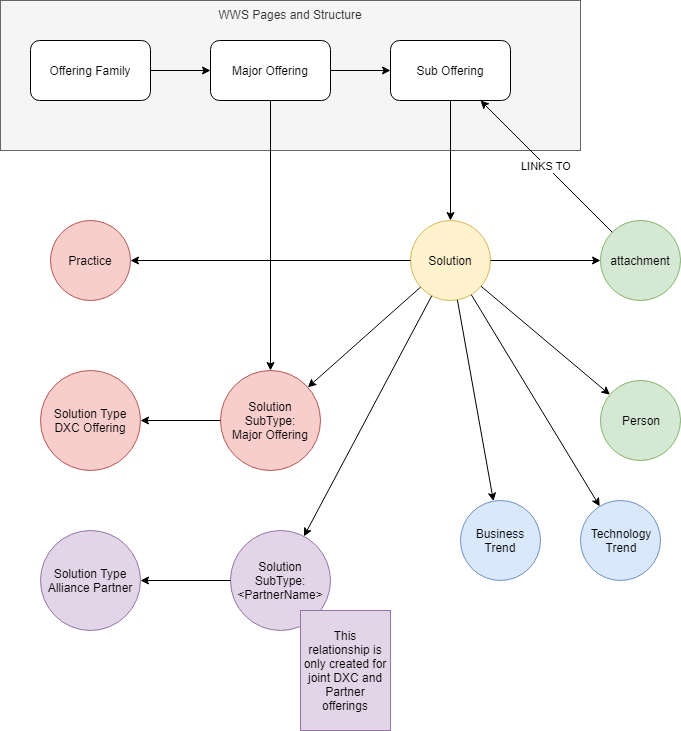

# WWS Sub Offering synchronization

The aim of the 2020 WWS Sync is to create solution models for each SubOffering within What We Sell.  The current implementation creates solution models at the Major Offering level.

## Target model
 

## Graph database set-up

- Create a new solution Type called DXC Offerings
- Automate the creation of the required Solution Sub Types based on the Major Offering information retrieved from WWS

## Field mappings within the Graph

### General fields and nodes

|WWS Field|DE Node|Graph Model
|---|---|---|
|Offering family|Practice|`(Solution)-[:ASSIGNED]->(Practice)`
|Major Offering|SolutionSubType - automatically generated from WWS data|`(Solution)-[:OfType]->(SolutionSubType {name:<value>})`
|Contacts|Person |`(Person)-[:ASSIGNED {role:<value>}]->(Solution`)|
|WWS URL|Attachment|`(Solution)-[]-(Attachment {name:<value>,URL:<value>})`

### Sub Offering field mappings

|WWS Field|Digital Explorer (node.property)
|---|---|
|Sub Offering Name|solution.name
|Short description|solution.pitch
|Description|solution.description
|Value Proposition|solution.ValueProposition
|Why DXC?|Solution.BusinessValue (2)
|Proof Points|Solution.TechnicalValue (1)
|Level Setting|Solution.BusinessValue (1)
|Deal Characteristics|TechnicalValue (2)

_Notes on Business and Technical Value mappings_
The two fields from WWS are combined into a single property in Digital Explorer with a `---` markdown value added between each field 

## Connecting to the Graph

All text fields within the solution node are analysed for matching business and technology trends and the following relationship is created

- `(Solution)-[:]->(BusinessTrend)`
- `(Solution)-[:]->(TechnologyTrend)`

---

## WWS API Information

WWS API Contact : brad.bode@dxc.com and cwatkins@dxc.com

---

## WWS Page validation

- [Page Validation 1](images/PageMapping1.png)
- [Page Validation 2](images/PageMapping2.png)
- [Page Validation 3](images/PageMapping3.png)
