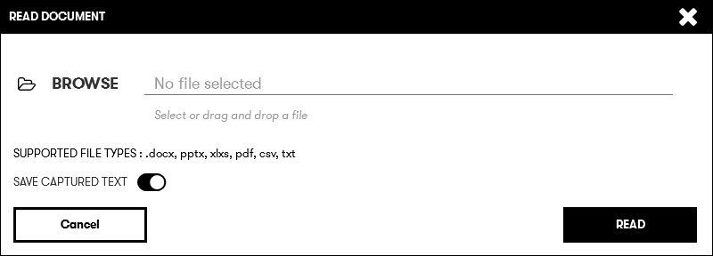
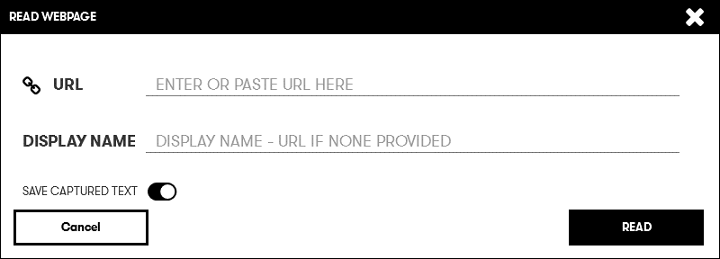
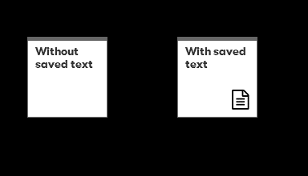
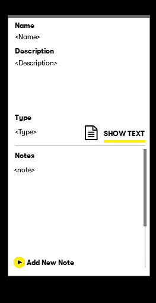
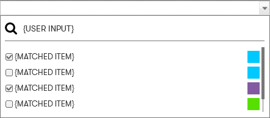
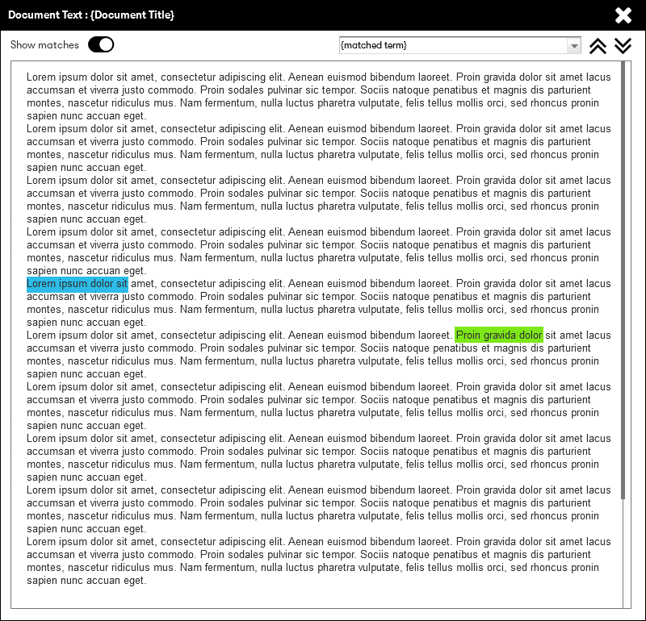
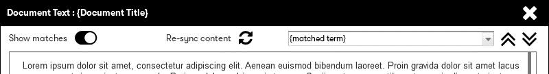
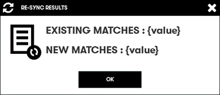

# Content Analyzer R2.0

Aim : Extend the current content analyzer to address the following requirements

1. Option to save (raw) text
2. Highlight matches within text
3. Re scan content
4. Highlight key themes
5. Add themes to the workspace
6. Add themes to signals
7. Translation 

### Release bundles

- R1 : 1 & 2
- R2 : 3
- R3 : 4 & 5
- R4 : 6
- R5 : 7

----

## Release 1 

### **Import and save text**

Option for users to save analyzed raw text during import.
 

#### Revised user dialog for `Read Document` and `Read Website`

  
 

#### New identifier on `Attachment` card

 

### **Highlight matches within text**

#### Revised information panel
  

#### Document content 

Users can select 1 or more of the matched terms within the viewer.

  

  

----

## Release 2
### **Re-scan Content**

Allow users the option to rescan their existing content against the current Digital Explorer dataset

  

The resync reprocess would remove all existing relationships between the selected attachment and the associated nodes and re-create them based on the results from the document reader API.  It would be possible to capture the current count of connections and present users with a before and after result score

 

----

## Release 3
### **Highlight key themes**

----

## Release 4
### ***Add themes to Signals**

----

## Release 5
### **Translation**

----

## Other platform consideration

- Need to also double label "Signal" nodes within Roadmaps to create a single collection
- Signal to trend is outside of the scope of work here

