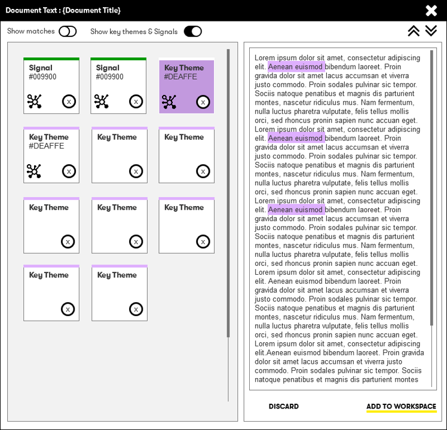

# Content Analyzer R2.0

Aim : Extend the current content analyzer to address the following requirements

1. Option to save (raw) text
2. Highlight matches within text
3. Re scan content
4. Highlight key themes
5. Add themes to the workspace
6. Add themes to signals
7. Translation 

### Release bundles

- R1 : 1 & 2
- R2 : 3
- R3 : 4 & 5
- R4 : 6
- R5 : 7

----

## Release 1 

### **Import and save text**

Option for users to save analyzed raw text during import.
 

#### Revised user dialog for `Read Document` and `Read Website`

  
 

#### New identifier on `Attachment` card

 

### **Highlight matches within text**

#### Revised information panel
  

#### Document content 

Users can select 1 or more of the matched terms within the viewer.

  

  

#### Related enhancement requests

- [#294 : Highlight matches](https://github.dxc.com/DigitalExplorer/Digital-Explorer-Specs/issues/294)

----

## Release 2
### **Re-scan Content**

Allow users the option to rescan their existing content against the current Digital Explorer dataset

  

The resync reprocess would remove all existing relationships between the selected attachment and the associated nodes and re-create them based on the results from the document reader API.  It would be possible to capture the current count of connections and present users with a before and after result score

 

----

## Release 3
### **Highlight key themes**

- disables `Show Matches` and removes the `select matches` dropdown
- Key theme information card shows number of occurrences
- Cards ordered highest first
- selected card triggers highlights within the text window
- users can step `up` and `down` through matches
- Option to discard theme (removes from view)
- Option to add theme as a `Theme` card to Workspace (new card\node type)
  - Adding the theme to the Workspace also includes the automated `note` detailed the origin of the theme

#### Card style
 

- Line colour : #DEAFFE

#### Key themes window

 

Highlights are triggered by single click/touch of the theme card 

  
_not sure yet on final selected card style_

#### Data Model

 

- A new `KeyTheme` node is created.
- Nodes are shared across the Digital Explorer Graph
  - First user to add creates the nodes
  - Following users relate to the created node

#### Related enhancement requests

- [#251 : Key Themes](https://github.dxc.com/DigitalExplorer/Digital-Explorer-Specs/issues/251)

----

## Release 4
### **Add themes to Signals**

As within the Roadmaps module `Signals` form a key insight into potential future trends or submissions into the industry taxonomies.

- Allow users to transfer a general `KeyTheme` 

#### Card style
 

- Line colour : #009900

#### Info Panel

 

----

## Release 5
### **Translation**

- Question : Is this visible to the users?

- Add an automated `Note` to the attachment card within the workspace.

`Translated from 'language' to English during analyse`

#### Related enhancement requests

- [#307 : Language Translation](https://github.dxc.com/DigitalExplorer/Digital-Explorer-Specs/issues/307)

----

## Other platform consideration

- Need to also double label "Signal" nodes within Roadmaps to create a single collection point
- **Signal to trend is outside of the scope of work here**

