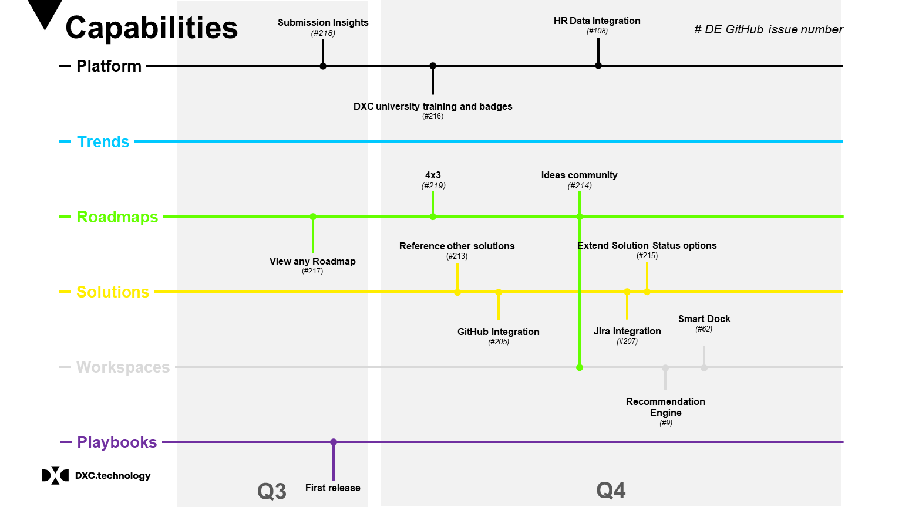

# Digital Explorer Developer notes

## :pencil: Working documentation for the development team of Digital Explorer :pencil: 

- Please feel free to explore our working notes, designs, code snippets and other non-production related topics.

- You can access the released SDK [here](https://github.dxc.com/DigitalExplorer/Digital-Explorer-Specs)

- To raise an enhancement or defect please click [here](https://github.dxc.com/DigitalExplorer/Digital-Explorer-Specs/issues)

## Roadmap

---

### Useful Links

- UI Scaling tests : http://quirktools.com/screenfly/
- DXC Taxonomy : https://my.dxc.com/our-company/global-functions/integrated-workforce-management/infrastructure-and-support/knowledge-management/km_taxonomy_classification.html
- Grommet (DXC) : http://grommet.io/dxc/docs/color 

